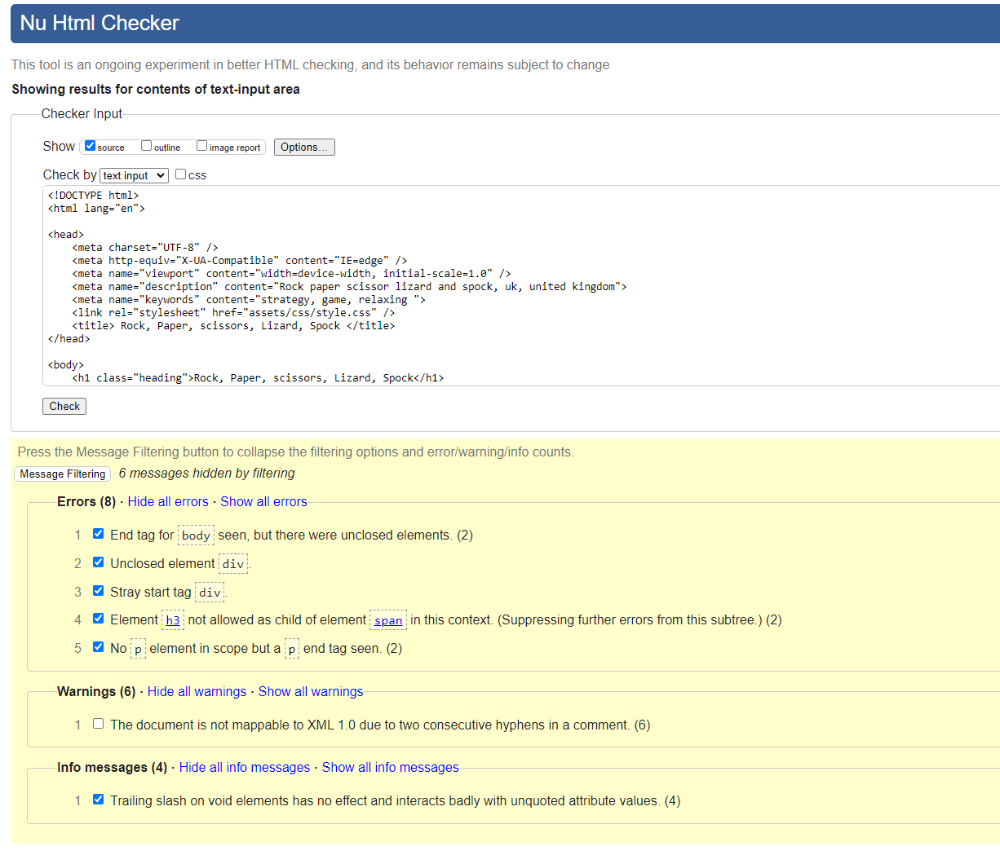
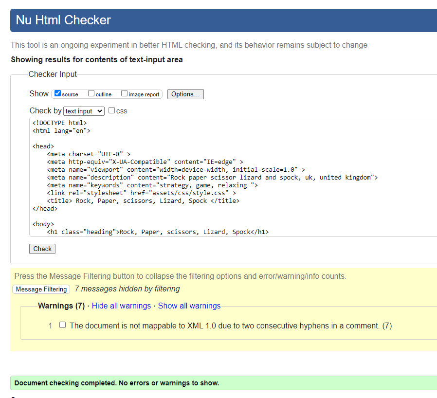
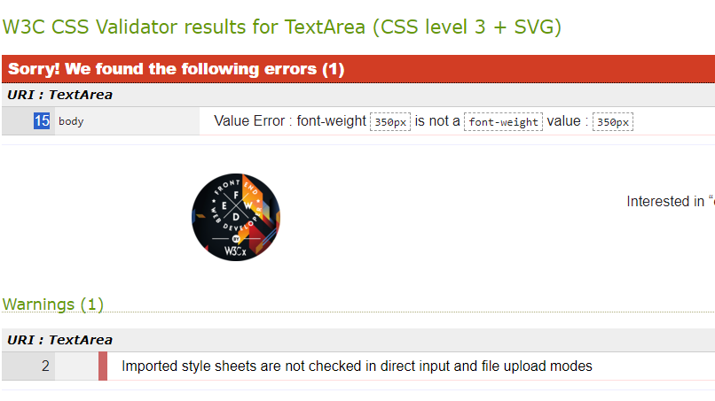
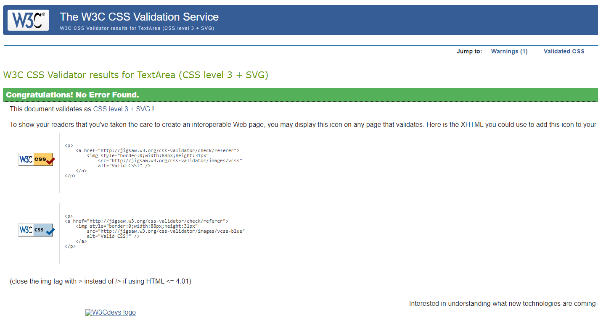
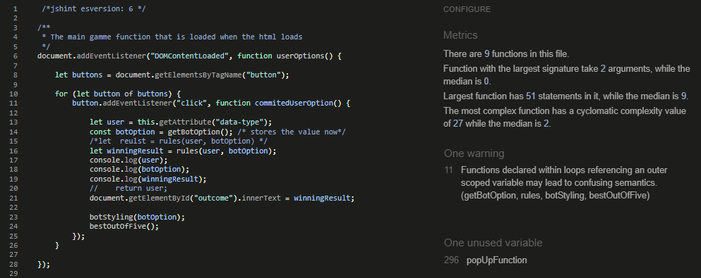
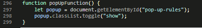
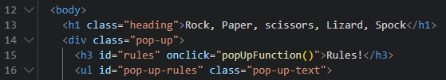

# Rock Paper Scissors Lizard Spock

## [Click here to view website](https://iainjackson90.github.io/pp2-rock-paper-scissors-lizard-spock/)

Rock Paper Scissors Lizard Spock is a game created that is simple to play.
It is desingend for people that hass a few moments to spare while on a break, or 
in general just want to pass time for a bit.

# UX

## Wireframe

## Colors used for the webpage

# Features

## Existing Features

# Testing

## Manual Testing

# Validator Testing

I put the game trough a series of validators to make sure it conforms to a valid 
standard here ate the test and results

## [HTML Validator](https://validator.w3.org/)

This was the inital html test it had some errors

I worked trough the errors fixing all od them and left with warnings becouse of, 
the coments I have in the html code to label sections of the code to make readability
and navigation trough the code easier.

## [CSS Validator](https://jigsaw.w3.org/css-validator/)

This was the inital test it had a error 

I fixed the error but made a consious desition to leave the coments that describes
the sections of the code for navigation perposes and readablility of the code

## [JS Validator](https://jshint.com/)

This was the innital test for the Java Script code it has no error only warnigs.
The mojority of warnings is from the loop function I created as my main function.

My popUpFunction is caled in directly in the HTML 

# Deployment

This site was deployed to GitHub and these are the steps that was taken to do so:

1. Log into GitHub
2. Navigate to repository (Left top corner)
3. Select the project  (The top let corner)
4. Settings (Nav bar at the top)
5. Pages (Left side menu)
6. Branch(Select main and folder as Root)
7. Save

Wait a while for it GitHub to deploy the webpage, when it is done it wil show
the link at the top

- ## _Cloning the GitHub repository_

This will download a full copy to your desktop

1. Log into GitHub
2. Find the repository you wish to clone
3. Find the green code button top right corner
4. Select "Local", copy the HTTPS URL
5. Go to Codeanywhere and navigate to "New Workspace"
6. Paste the URL into the space provided
7. Click "Create"

- ## _Forking the GitHub repository_

Will allow you to create a copy of the repository so changes can be made that will not affect the original repository.

1. Log into GitHub
2. Find the repository you wish to fork
3. Find the "Fork" drop down in the top right corner second from last
4. Select "Create"  

# Technologies Used

# Credits

## Content

## Media

