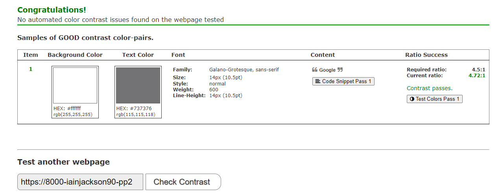

# Rock Paper Scissors Lizard Spock

## [Click here to view website](https://iainjackson90.github.io/pp2-rock-paper-scissors-lizard-spock/)

Rock Paper Scissors Lizard Spock is a game created that is simple to play.
It is designed for people that has a few moments to spare while on a break, or
In general just want to pass time for a bit.

# UX

## Strategy

This game was created with the intent to catch the attention of anyone who comes across this game.
The targeted audience of this game is to everyone and all ages looking for a fun strategy game that has some time to pass whether it is a quick lunch break or a breather just wanting to relax.
It is a simple game and easily understandable

## Scope

The Game will:

- Accept a user input
- Create a random choice from the bot
- Compare the values
- Evaluate who won the round
- Increment the score of the winner of the round
- Evaluate who won the best of five games
- Reset the score after five games

## Structure

The game will be structured with user experience in mind, it will be displayed
on a single page with no overflow.
Whether it is a large screen or mobile device it should fit all on the screen not detecting the user with any scrolling effects, not breaking the users attention of the game.

## Skeleton

Some features of the wireframe has change as the development of the game went on, as I felt some features would be better incorporated into the design than others

This is the original wireframe design

### Wireframe

## Surface

When designing the surface I went for a cartoon look and colorful with a fun text font to match the the game

### Font

the font I used was Shantell Sans

### Color pallet of the webpage

# Features

The features were created with the mindset of displaying clearly what option was selected and have a clean layout for easy user experience with ey capturing pictures and colors to grab the user attention.

## Existing Features

The rules PupUp will display all the rules when it is clicked on and displayed on a lime green background. When you hover over the rules on desktop it will have a shadow of red and on mobile it will have a shadow after clicking on it.

The user choice will have a green shadow when you hover over the image on desktop and on mobile it will have a green background if you select an option.

The Bot will have a random choice and it will be displayed with a red shadow

The green text displays the outcome of who won the round

The red text will only appear at the end of the fifth round displaying who won the best of the five games

the score will increment depending on who won and reset after five rounds

When the page loads on smaller screen sizes or on mobile devices it will rearrange the page so all the content will fit to the screen and the center image of the page will have an opacity and all the messages will be displayed over the center image.

# Testing

I did various tests to ensure that I got the results that were intended.

Manual testing was done by playing the game, testing if the results that were given are the correct ones comparing it with the rules and double checking the score board and making sure after five rounds it resets the score back to zero.

Validation testing was done for HTML, CSS and JavaScript to ensure the code conforms to the standards. All code passed at the end with no errors, there were some warnings in HTM and CSS because of my comments I created to make code readability more easy and navigating through the code.

Lighthouse testing was done to try and improve on performance score as much as I could the biggest drawback of performance is my main function in JavaScript which is a loop and I am sure there must be a different way of doing it but not without the cost of having to redo most of the code, it is not a bad idea but for the purpose of this game and my current knowledge I will have to do more research to improve the code to gain more performance.

## Manual Testing

| What was tested | Result | Outcome |
|:---:|:---:|:---:|
|The game rules pop down up| Pop up with the rules | Works as intended|
|Each button of the user was clicked| Changes the shadow color to green | works as intended|
|Bot choice|Change the shadow to red of chosen choice| works as intended|
|Random bot choose|The bot will have a random choice every time the game runs|Works as intended
|Display message in green |Display the choice of the user and the bot and who won the round|Works as intended|
|Display message in red |Display only after five rounds Stating who won the best of the five rounds|Works as intended|
|Score|Score increments depending on who won the round and resets after five rounds|Works as intended|

# Validator Testing

I put the game through a series of validators to make sure it conforms to a valid
standard here are the test and results

## [HTML Validator](https://validator.w3.org/)

This was the initial html test it had some errors

I worked through the errors fixing all of them and left with warnings because of,
the comments I have in the html code to label sections of the code to make readability
and navigation through the code is easier.

## [CSS Validator](https://jigsaw.w3.org/css-validator/)

This was the initial test it had a error

I fixed the error but made a conscious decision to leave the comments that describes
the sections of the code for navigation purposes and readability of the code

## [Color Validator](https://color.a11y.com/)

I tested the contrast and this was the result

## [JS Validator](https://jshint.com/)

This was the initial test for the Java Script code; it has no error, only warnings.
The majority of warnings are from the loop function I created as my main function.

My popUpFunction is called in directly in the HTML

## Lighthouse testing for desktop

I used Lighthouse to test the performance for desktop and mobile
this was the performance I got for desktop and mobile on the first test

### Desktop test one

### Desktop test two

I improved the accessibility by working on the contrast for the rules and changing
the rules from a h3 html tag to a h2 html tag to conform with the rules

### Mobile test one

### Mobile test two

I resized all the images to smaller sizes using tiiny.png to improve performance
but still take a big hit on performance due to the main function in javascript being a loop

# Deployment

This site was deployed to GitHub and these are the steps that was taken to do so:

1. Log into GitHub
2. Navigate to repository (Left top corner)
3. Select the project  (The top let corner)
4. Settings (Nav bar at the top)
5. Pages (Left side menu)
6. Branch(Select main and folder as Root)
7. Save

Wait a while for it GitHub to deploy the webpage, when it is done it wil show
the link at the top

- ## _Cloning the GitHub repository_

This will download a full copy to your desktop

1. Log into GitHub
2. Find the repository you wish to clone
3. Find the green code button top right corner
4. Select "Local", copy the HTTPS URL
5. Go to Codeanywhere and navigate to "New Workspace"
6. Paste the URL into the space provided
7. Click "Create"

- ## _Forking the GitHub repository_

Will allow you to create a copy of the repository so changes can be made that will not affect the original repository.

1. Log into GitHub
2. Find the repository you wish to fork
3. Find the "Fork" drop down in the top right corner second from last
4. Select "Create"  

# Technologies Used

- Html
- Css
- JavaScript
- [Google Fonts](https://fonts.google.com/)
- Chrome dev tools
- [TinyPNG](https://tinypng.com/)
- [Font Awsome](https://fontawesome.com/)
- [Codeanywhere](https://codeanywhere.com/)
- [GitHub](https://github.com/)
- [Color Pelet](https://www.color-hex.com/color-palette/94134)
- [Color Contrast Accessibility Validator](https://color.a11y.com/)
- [W3C Markup Validation](https://validator.w3.org/)
- [W3C CSS Validation](https://jigsaw.w3.org/css-validator/)
- [FREEFORMATTER](https://www.freeformatter.com/)  For HTM and CSS
- [JSHint](https://jshint.com/)
- [Am I Responsive](https://ui.dev/amiresponsive)
- [Google Docs](https://docs.google.com/document/u/0/)
- [imagecolorpicker](https://imagecolorpicker.com/)
- Microsoft Paint
- Snipping Tool

# Credits

- Code Institute for the learning content provided
- Harry Dhillon my assigned mentor to give advise on the project
- Nicole Jackson my wife a student at code institute for constructive criticism
- Slack community
- [w3schools](https://www.w3schools.com/)
- [stackoverflow](https://stackoverflow.com/)

## Content

- [Color Pelet](https://www.color-hex.com/color-palette/94134) inspiration from color-hex
- [Box-Shadow](https://www.shecodes.io/athena/21966-how-to-add-a-shadow-to-a-button-in-css#:~:text=To%20add%20a%20shadow%20to%20a%20button%20in%20CSS%2C%20you,use%20the%20box%2Dshadow%20property.&text=The%20box%2Dshadow%20property%20takes,moves%20it%20to%20the%20left.) SheCodes for guidence
- [Box-Shadow in JavasSript](https://www.w3schools.com/jsref/tryit.asp?filename=tryjsref_style_boxshadow) w3schools for guidance
- [Text-Shadow](https://www.w3schools.com/cssref/tryit.php?filename=trycss3_text-shadow_blur
) w3schools For guidance
- [transform: Translate("value%","value%")](https://www.w3.org/wiki/CSS3_2D_Transforms) w3schools For guidance
- [PopUp](https://www.w3schools.com/howto/howto_js_popup.asp) w3schools For guidance
- [Rules of game](https://bigbangtheory.fandom.com/wiki/Rock,_Paper,_Scissors,_Lizard,_Spock) bigbangtheory Rules of the game

## Media

- [PNG Images](https://www.clipartmax.com/) From clipartmax
